# k8s-crash-course

Kubernetes manifests for MongoDB + a demo webapp. This is a hands-on project based on [Nana Janashia's Kubernetes crash course](https://www.youtube.com/watch?v=s_o8dwzRlu4).

## 📋 Project Overview

This demo deploys:
- **MongoDB** database with authentication
- **Web application** that connects to MongoDB
- External configuration via **ConfigMap** and **Secret**
- External access to the webapp via **NodePort Service**

**Architecture:**

```mermaid
graph LR
    User[👤 Browser] --> NodePort[NodePort Service<br/>webapp-service:30100]
    
    NodePort --> WebApp[WebApp Pod<br/>nanajanashia/k8s-demo-app]
    
    ConfigMap[📝 ConfigMap<br/>mongo-config] -.->|DB_URL| WebApp
    Secret[🔐 Secret<br/>mongo-secret] -.->|USER_NAME<br/>USER_PWD| WebApp
    
    WebApp --> MongoSvc[ClusterIP Service<br/>mongo-service:27017]
    MongoSvc --> MongoDB[MongoDB Pod<br/>mongo:5.0]
    
    Secret -.->|MONGO_INITDB_ROOT_USERNAME<br/>MONGO_INITDB_ROOT_PASSWORD| MongoDB
    
    style User fill:#e1f5ff
    style NodePort fill:#fff4e6
    style WebApp fill:#f3e5f5
    style MongoDB fill:#e8f5e9
    style ConfigMap fill:#fff9c4
    style Secret fill:#ffebee
    style MongoSvc fill:#e0f2f1
```



## 📂 Files

| File | Description |
|------|-------------|
| `mongo-config.yaml` | ConfigMap with MongoDB service URL |
| `mongo-secret.yaml` | Secret with MongoDB credentials (base64 encoded) |
| `mongo.yaml` | MongoDB Deployment + Internal Service |
| `webapp.yml` | Web app Deployment + NodePort Service |

## 🚀 Prerequisites

- [Minikube](https://minikube.sigs.k8s.io/docs/start/) installed
- [kubectl](https://kubernetes.io/docs/tasks/tools/) installed
- Docker (as Minikube driver)

## 📦 Deployment

### 1. Start Minikube

```bash
minikube start --driver docker
minikube status
```

### 2. Apply Manifests

> **Important**: ConfigMap and Secret must be created before Deployments!

```bash
kubectl apply -f mongo-config.yaml
kubectl apply -f mongo-secret.yaml
kubectl apply -f mongo.yaml
kubectl apply -f webapp.yml
```

### 3. Verify Deployment

```bash
# Check all resources
kubectl get all

# Check pods are running
kubectl get pods

# Check services
kubectl get service
```

## 🌐 Access the Web Application

### ⚠️ Important: NodePort Access on macOS/Docker Driver

The `minikube ip` + NodePort approach (`http://192.168.49.2:30100`) **will NOT work** on macOS with Docker driver because the Node IP is on an internal network unreachable from the host.

### ✅ Option 1: Minikube Service (Recommended)

Minikube creates a tunnel and exposes the service on `localhost`:

```bash
# Get the URL and open in browser
minikube service webapp-service --url
```

This will output something like `http://127.0.0.1:52439`. Open that URL in your browser.

### ✅ Option 2: Port Forwarding

Create a local tunnel to the service:

```bash
kubectl port-forward svc/webapp-service 3000:3000
```

Then access at `http://localhost:3000`

## 🔍 Troubleshooting

### Check Pod Logs

```bash
# Get pod name
kubectl get pods

# View logs
kubectl logs webapp-deployment-<pod-id>

# Stream logs
kubectl logs webapp-deployment-<pod-id> -f
```

### Check Service Details

```bash
kubectl describe service webapp-service
```

### Check if App Responds Inside Cluster

```bash
# Exec into the webapp pod
kubectl exec -it deploy/webapp-deployment -- sh

# Try wget from inside (if available)
wget -qO- http://127.0.0.1:3000/
```

## 🧹 Cleanup

```bash
# Delete all resources
kubectl delete -f webapp.yml
kubectl delete -f mongo.yaml
kubectl delete -f mongo-secret.yaml
kubectl delete -f mongo-config.yaml

# Or delete everything at once
kubectl delete all --all

# Stop Minikube
minikube stop

# Delete Minikube cluster
minikube delete
```

## 📚 Key Kubernetes Concepts Demonstrated

### ConfigMap
- External configuration for applications
- Non-confidential data (e.g., service URLs)
- Referenced as environment variables in Pods

### Secret
- Stores sensitive data (credentials)
- Base64 encoded (not encrypted!)
- Should NOT be committed to Git in production

### Deployment
- Blueprint for creating Pods
- Manages replicas and rolling updates
- Abstraction over Pods

### Service
- Permanent IP address for Pods
- Load balancer for Pod replicas
- Types: ClusterIP (internal), NodePort (external), LoadBalancer

### Labels & Selectors
- Labels identify and group resources
- Selectors match Pods to Services/Deployments
- Example: `app: webapp` connects Service → Pods

## 🔗 Resources

- [Official Kubernetes Documentation](https://kubernetes.io/docs/home/)
- [Nana Janashia's Tutorial](https://www.youtube.com/watch?v=s_o8dwzRlu4)
- [Original Tutorial Repo](https://gitlab.com/nanuchi/k8s-in-1-hour)
- [Docker Hub: nanajanashia/k8s-demo-app](https://hub.docker.com/r/nanajanashia/k8s-demo-app)

## 📝 Notes

- MongoDB credentials: `mongouser` / `mongopassword` (base64 encoded in secret)
- NodePort range: 30000-32767
- This setup is for **learning/development only** - not production-ready
